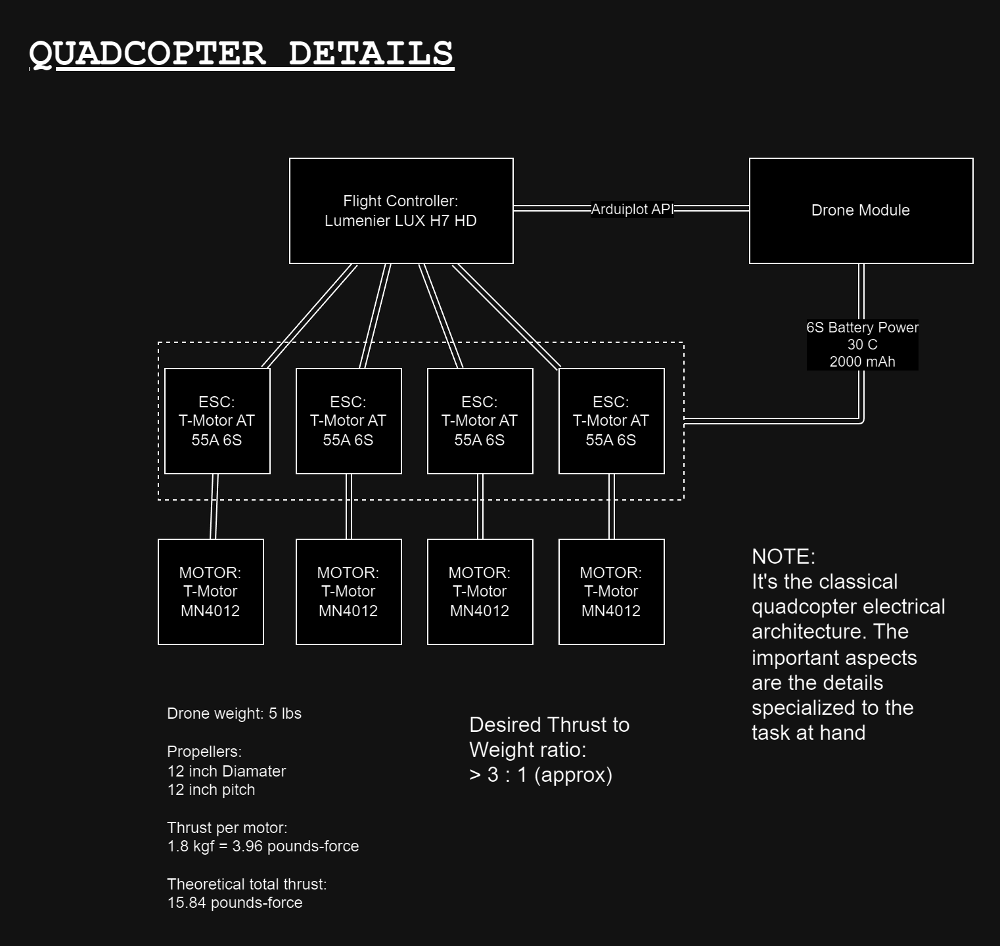

# NSL_23-24_PayloadEECS 🚀

## Payload System

## Resources

[ESP32S3 Docs](https://wiki.seeedstudio.com/xiao_esp32s3_getting_started/#hardware-overview)

## Transmitters Table
Netowrk ID : 5

|    **Name**     | **Frequency**                                      | **Channel** |
| --------------- | -------------------------------------------------- | ------- |
| Deployment LoRa | 905 MHz                                            |    5    |
| Drone LoRa      | 905 MHz                                            |    10   |
| Recovery LoRa   | 442 MHz                                            |    9    |

## Viewing charts

For flowcharts and general charts we make, we use [Draw.io](https://draw.io), so just go there and import the drawio files.
