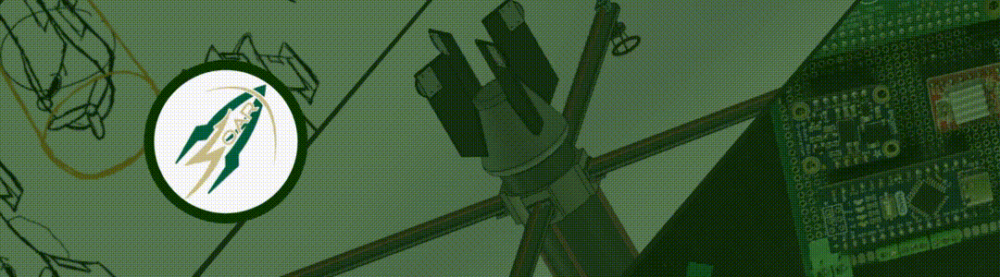
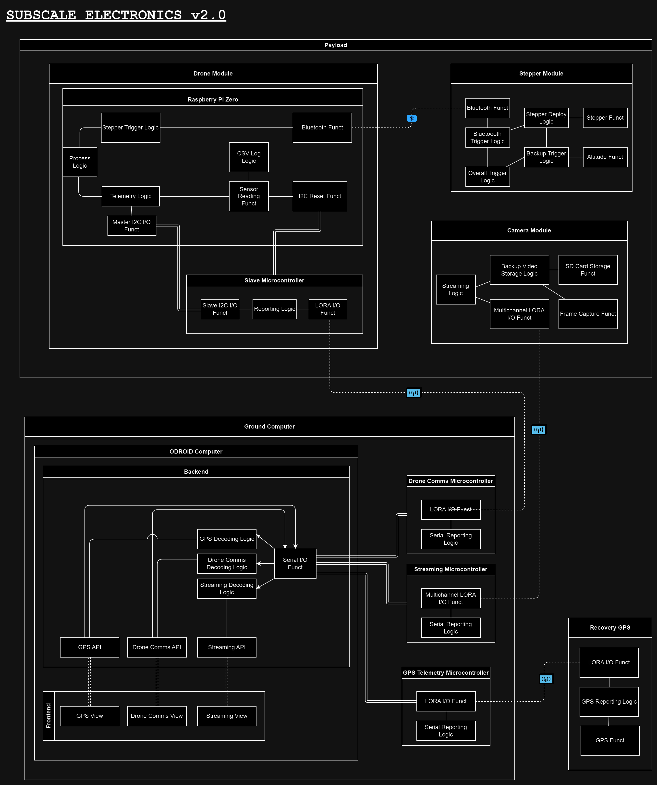

# NSL_23-24_PayloadEECS 🚀

## Payload System

## Resources

[ESP32S3 Docs](https://wiki.seeedstudio.com/xiao_esp32s3_getting_started/#hardware-overview)

## Transceiver Legal Disclaimer

Certain systems of the Ground Station and the Rocket Recovery systems will utilize an Adafruit RFM96W LoRa Radio Transceiver Breakout, 433 MHz version.
The product link is the following: https://www.adafruit.com/product/3073

It is noted that this transceiver operates on the 420-450 MHz radio frequencies, which are regulated for use by those in the Amateur Radio Service. To comply
with this, only personnel that hold an FCC Amateur Radio License of the class Technician or higher will be allowed to operate the Ground Station and engage
in radio frequency communications through this transceiver.

It is also noted that this transceiver does not hold an FCC Equipment Authorization. All radio frequency devices in the US must comply with the rules set forth in 47 CFR Part 2. Typically, compliance is shown through an FCC Equipment Authorization, or by following regulations to be considered as an exception. It is understood that it is not the responsibility of the consumer should the manufacturer violate FCC regulations, but it is the consumer’s responsibility to follow FCC regulations for the operation of radio frequency equipment. In accordance with 47 CFR 15.23, equipment authorization is not required for home-built devices, which would classify the use case of this transceiver (the Adafruit RFM96W LoRa Radio Transceiver Breakout). Fewer than 5 of these transceivers will be utilized in total, to create fewer than 5 home-built devices, and will not be marketed. Good engineering practices will be employed to meet technical standards specified by the FCC as much as possible.

Furthermore, upon assembly of this system, long distance testing will be conducted. This will be to ensure the functionality of the system over long distances, to simulate launch conditions when the rocket can travel a horizontal distance of up to 2500 feet. Long distance testing will be conducted incrementally, starting out by testing functionality and data transmission over short distances such as 500 feet, and then incrementally increasing up to 2500 feet. Should test results indicate the received signal to be too weak to reliably transmit data, then antennas of a sufficient gain will be attached to the transceivers to amplify the strength of the signal until reliable data transmission between the Rocket and Payload systems to the Ground Station are achieved. The potential addition of antennas will further cement the
home-built status of the transceivers, as these modifications will significantly change the effective transmission power that the transceivers emit radio frequency
signals.

## Payload setup Instructions

There is 3 components for the payload for the subscale launch `12/23/2023`. The deployment system, the payload system and the ground station.

### Deployment system setup

If short on time just connect the 14v battery directly to the deployment module and wrap it in. However if we have time we should check the voltage levels. So do the following:

1. Take out the BMP390 sensor to expose the terminal screws
2. Unscrew the terminal connected to the ground wire that's directly connected to the buck converter
3. Remove the ground wire from the deployment module, if cannot ensured proper supervision over that wire just cover it in masking tape
   
4. Plug in the 14v battery to the battery port
5. Take a multimeter and put the tips on the buck converter. The red tip put it where it says OUT+ and the black tip where it says OUT-
   
6. Make sure the output is around 5v (or -5V if the cables are swapped)
7. If it's around 5V Great Job skip to `step 10`
8. If it's not around 5V then get a small flathead screwdriver and screw the little potentiometer little by little. Measure with the potentiometer as you go
   
9. Stop when you're around 5V (or -5V), put some electrical tape over the potentiometer
10. Unplug the battery
11. Plug back in the black cable to the deployment module
12. Plug back in the BMP390
13. Plug in the stepper motor to the pins that are on the front of the deployment module, make sure the small metal side is facing up.
    
14. `IF` the pins seem to fragile either:

    - Add some solder to the pins to increase friction
    - Remove the black holder since that is just reducing the pins space

15. Plug in the battery again and you're good to go

This step is suggested before the payload setup itself given that the paylaod at startup will start looking for the bluetooth server of the deployment module, therefore it'll be just better to have the deployment module ready.

### Payload System Setup

The payload system should just requrie plugging in the 3.7V battery to ground and power pins of the boost converter. Would suggest to do this last possible given that the 3.7 Volt battery can guarantee us at MAX 2.8h of work, so let's try to be efficient with it's use.

To be safe plug in the battery and use a multimeter to check the output of VOUT+ and VOUT- of the boost converter. The magnitude of the output should be around 5v.

`IF` the magnitude is not 5V:

1. plug out the battery entirely
2. Plug out the ground cable connected from the payload to the boost converter
3. Plug in the battery again
4. Check the output voltage on VOUT+ and VOUT-
5. Use a small screwdriver to turn the little potentiometer on the boost converter
6. Continously check the voltage and stop when around 5V (ideally between 5.0 and 5.1 given that this is a situation of low voltage to higher voltage)
7. Unplug the battery
8. Plug back in the ground cable from the rest of the payload
9. Plug the battery back in

`IF` the 3.7v battery currently strapped to the payload get's plugged in and doesn't seem to work, then we have 2 options:

1. Recharge it, if it's completely drained it will take 2 to 3 hours
2. Replace it with the other battery, you will need to cut the zip ties straping it to the payload and the zip ties straping it to the boost converter

Appart from the exception above, the payload should start working automatically once it gets power.

### Ground Station Setup

`IF` junior Engineer is onsite and deployment functionality as well as CSV log functionality is ready, perform flight monitoring and deployment trigger using SOAR Echo Base Server.

`ELSE` to be safe just monitor the output of the Payload thorugh a serial monitor and an Arduino, do the following:

1. Connect an Arduino to any computer with the Arduino IDE installed
2. Open up a serial monitor and set the baud rate to `115200`
3. Wait for a couple of seconds, some lines should appear on the screen, that's just setting up the LoRa's
4. The whole system can be tested via the following command: `STOP:repeat`. You should receive 2 responses from the payload, the first one indicates succesful connection to the paylaod, the second one will indicate succesful connection to the deployment module also
5. After testing type `IDLE:repeat` and after a few seconds just type `IDLE`
6. Once flight starts I suggest not to type any command as to not overcrowd the RF spectrum, if the test was successful we should be observing altimeter data coming in every 10 seconds
7. The deployment module is setup to automatically deploy, however to provide an extra layer of redundancy, once we observe the rocket to be at apogee, type `DEPLOY:repeat` on the serial monitor input
8. Again should receive 2 confirmations for the rocket one that replies `ATTEMPT DEPLOY` another one that replies `DEPLOY STARTED`
9. Once the payload has landed, if possible take all that was printed on the serial monitor and store it in a .txt file

To start GPS monitoring, `IF` a Junior Engineer is onsite, they can perform the GPS setup, `ELSE`:

1. Close the serial monitor on the Arduino IDE
2. Spin up SOAR Echo Base
3. Navigate to `/gps_data`
4. Press start gps

## EMERGENCY PROCEDURES

As of `12/23/2023` the only emergency procedure in place is if payload starts extending when it shouldn't. Therefore to stop it, use the Arduino terminal setup for the ground station and type on the input line: `STOP:repeat` and if desired to retract type `RETRACT:repeat` and afterward type: `RESET:repeat`. Once all of that is done I'd suggest typing `IDLE:repeat` and after a few seconds type just `IDLE`, that just "cleans the airwaves".

## Viewing charts

For flowcharts and general charts we make, we use [Draw.io](https://draw.io), so just go there and import the drawio files.
