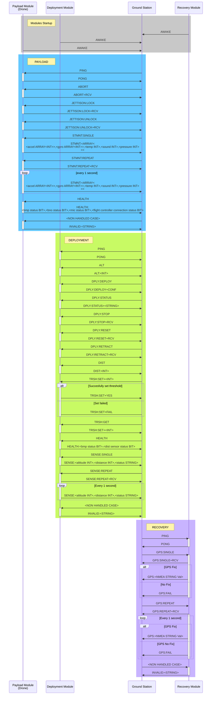

# NSL_23-24_PayloadEECS 🚀


## For new members
Hello and welcome to SOAR's Payload EECS repository. 

Please feel free to take on any issue on the [issues tab](/issues).

If you want to contribute first Download [Github Desktop](https://desktop.github.com/) and set it up to your github account. 

After that there are currently 2 approaches for contributions:
1. ***Forking our repo***: This is the easiest way to get started, no permissions required. Watch [this video](https://youtu.be/uhwIgnRaXew)

2. ***Creating a branch as a member***: This way requires you to be added to one of our teams, so if you're not sure aobut staying long term I'd suggest starting with *forking*, but if you're commited to helping us out here is what you can do:
> 1. Ask one of the leads to add you to a team as a contributor
> 2. Accept the team invitation in your email
> 3. Follow [this video](https://youtu.be/tXrt2rXsAjA) on how to make contributions as a team member
<!-- > 3. Open Github Desktop then click on `File > Clone Repository` Then switcht to the tab `URL` and paste our repo link: `https://github.com/usfsoar/NSL_23-24_PayloadEECS`
> 4. Once cloned and in your computer you are ready for your first contribution
> 5. Pick an issue from the [issues tab](/issues) and assign yourself to it
> 6. On Github desktop toolbar click on `Branch > New Branch`. Name the branch as something related to the issue you will be taking, I'd suggest `issue/47-fixing-bluetooth` for example
> 7. Modify the code as you see fit to solve the issue you chose.
> 8. Once your code is ready commit, push and publish your branch,and then head over to the [Pull Requests tab](/pulls)
> 9. Create a pull request and make sure to specify your branch as the `compare`
> 10. Write a short description on the changes you did and if you want add @L42ARO as a reviewer
> 11. Create the pull request and if the changes don't break anything it should be added -->

Either approach you take, you're gaining some valuable `git` skills, furthermore you can make as much mistakes as needed, it's part of learning! And you won't have to fear "breaking something important".

### Some tips on picking up Issues
- Any issue with the label `Good First Issue` is probably an easy issue to start with and it might have a guided solution to follow
- Some issues may say **Blocked by** and then list another issue, this just means you most likely need to solve that other issue first or wait for someone else to solve it before proceeding
- Issues should be labeled with the programming language required so you can pick and choose what you're most comfortable

## Keeping up to date your branch/fork
We are constantly making changes to our repo so don't worry if you ever feel behind, that's usual. To keep up to date your code, perform the following:
1. If you're not on a fork, checkout to the branch `main` and pull the latest changes. Then checkout back to your branch.
2. On Github Desktop click on `Branch > Rebase Current Branch`
3. If you're on a fork select `upstream/main`, else select `main`
4. Proceed with the rebase and hopefully by the end of it you should see on the push button the word `force push`
5. Force push your changes to your branch
6. **IF** rebasing doesn't work then attempt to merge to either `upstream/main` if on fork or just `main` if not on fork
> Merging creates a messier git commit history but there are times it's the only option

## Compilling for the ESP32S3
1. Follow the guide [here](https://wiki.seeedstudio.com/xiao_esp32s3_getting_started/#software-preparation) under software preparation.
2. After, open the Arduino IDE and select the board `XIAO_ESP32S3`.
4. Click on the libraries button:


5. Install the following libraries (along any dependencies if they ask for it):
   - `Adafruit BMP3XX` by Adafruit
   - `Adafruit GPS` by Adafruit
   - `Adafruit Unified Sensor` by Adafruit
   - `Adafruit BusIO` by Adafruit
   - `Async ElegantOTA` by Ayush Sharma
   - `Async TCP` by dvarrel
   - `ESP Async Webserver` by Me-No-Dev
   - `ESP32Servo` by Kevin Harrington, John K. Bennet
   - `ESPAsyncTCP` by dvarrel
   - `ESPAsyncWebServ` by dvarrel
   - 
6. Click on the complie button
7. **IF** Successful you are done. **ELSE** try installing the libraries it might suggest to install.
  > **NOTE**: Don't install any `BLE` or `Bluetooth` libraries that is already installed when you included the `XIAO_ESP32S3` board
## Resources

- [ESP32S3 Docs](https://wiki.seeedstudio.com/xiao_esp32s3_getting_started/#hardware-overview)
- [BNO055 IMU Docs](https://learn.adafruit.com/adafruit-bno055-absolute-orientation-sensor/arduino-code)
- [BMP390 Baromter Docs](https://learn.adafruit.com/adafruit-bmp388-bmp390-bmp3xx/arduino)
- [900 Mhz Lora docs](https://reyax.com/products/rylr998/)
- [SOAR Wiki](https://github.com/usfsoar/wiki/wiki)
- [Payload Wiki](https://github.com/usfsoar/NSL_23-24_PayloadEECS/wiki)

## Viewing charts

For flowcharts and general charts we make, we use [Draw.io](https://draw.io), so just go there and import the drawio files.

## Comms Standard
A typical LORA string would look like this:
```
+RCV=<sender address>,<length>,<data>,<rssi>,<snr>
```
As it can be seen it already contains overhead data that details who is sending it, therefore for our commands standard we will skip specifying who is the sender in the `<data>` field.
### Shared Patterns
- Every module will send `AWAKE` on startup
- If a `PING` is received every module should send back a `PONG` this will be used to check if the module's ***LoRa*** is active
- For non handled cases every module should send back `INVALID:<string>` where the *\<string\>* portion is the unhandled case sent
- Most commands should specify with a short *prefix* which group their action falls under so that the response can label itself under that action. **Ex:** an altitude request should have a prefix of `ALT:`, so that the response can say `ALT:<value>`.
- Commands that are too important like `ABORT`, or `PING` do not need to be preceded by anything since it's important for the program to interpret them easily and fast
- Certain commands that trigger actions inside the modules that may not lead to immediate feedback (**Ex:** `GPS:SINGLE` cannot send back GPS data until the GPS gets a *Fix*), should send back the same command they received with `+RCV` as a postfix. This helps us ensure commands are being received. 
  >**Ex:**
  >```mermaid
  >sequenceDiagram
  >participant R as Recovery Module
  >participant G as Ground Station
  >G->>R: GPS:SINGLE
  >    activate R
  >    R->>G: GPS:SINGLE+RCV
  >    note right of R: Then it can wait for a GPS FIX
  >```
### SUMMARY

> Sample GPS NEMA: A,2803.9766,000,08225.0083,W
