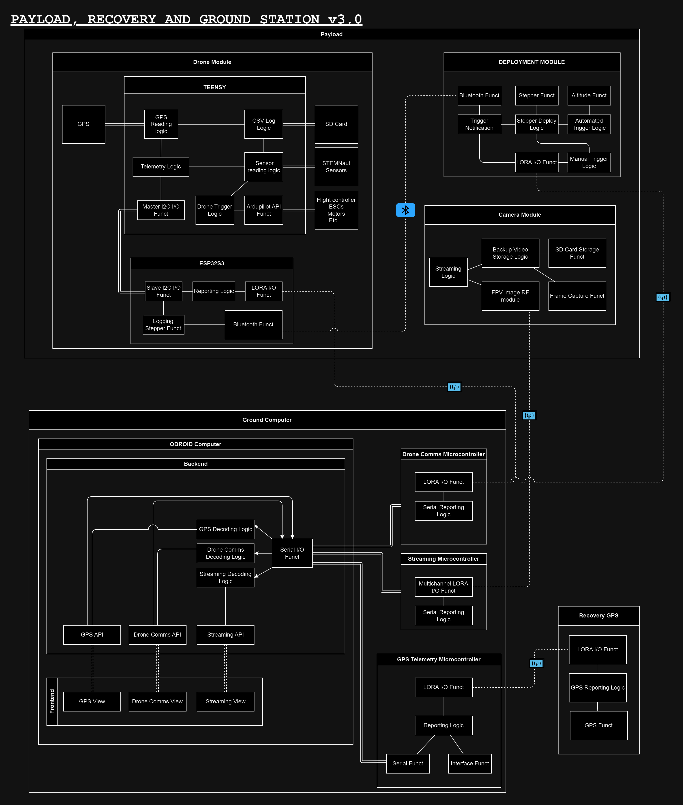

# NSL_23-24_PayloadEECS 🚀

## Getting started
### For new members
Watch this video below

> 

## For leads

1. Clone this repo on your computer
2. If you take on an issue create a branch to work on that issue. Name it however you want or if you want name it like `issue/46-fix-this-thing`
3. Once your code is complete create a pull request referencing your branch
4. Explain a little why you're making the change you're making
5. Wait for another lead to verify it and it'll get merged

## Resources

- [ESP32S3 Docs](https://wiki.seeedstudio.com/xiao_esp32s3_getting_started/#hardware-overview)
- [BNO055 IMU Docs](https://learn.adafruit.com/adafruit-bno055-absolute-orientation-sensor/arduino-code)
- [BMP390 Baromter Docs](https://learn.adafruit.com/adafruit-bmp388-bmp390-bmp3xx/arduino)
- [900 Mhz Lora docs](https://reyax.com/products/rylr998/)

## Payload System

## Transmitters Table
Netowrk ID : 5

|    **Name**     | **Frequency**                                      | **Channel** |
| --------------- | -------------------------------------------------- | ------- |
| Deployment LoRa | 905 MHz                                            |    5    |
| Drone LoRa      | 905 MHz                                            |    10   |
| Recovery LoRa   | 442 MHz                                            |    9    |

## Viewing charts

For flowcharts and general charts we make, we use [Draw.io](https://draw.io), so just go there and import the drawio files.
